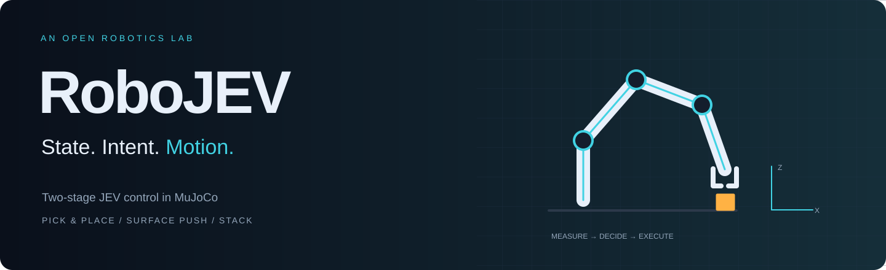
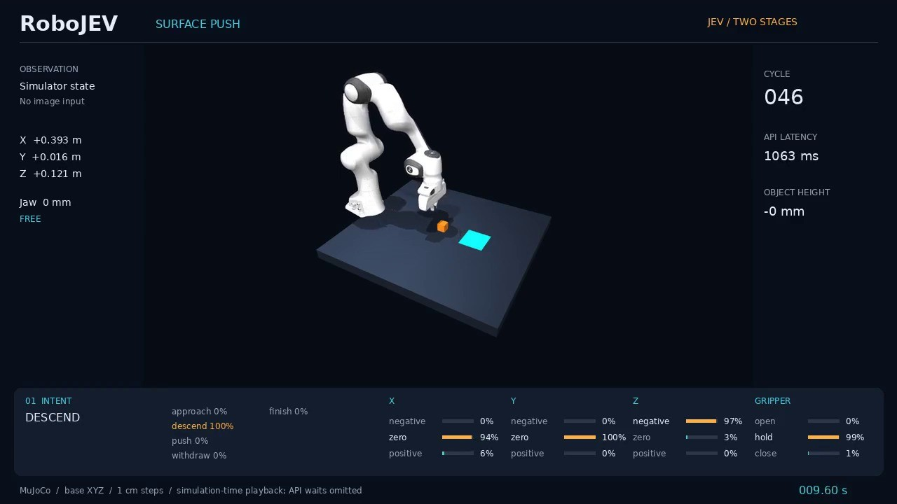
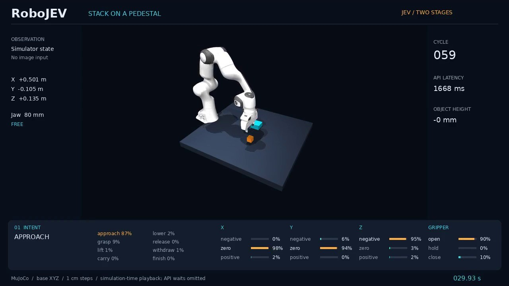
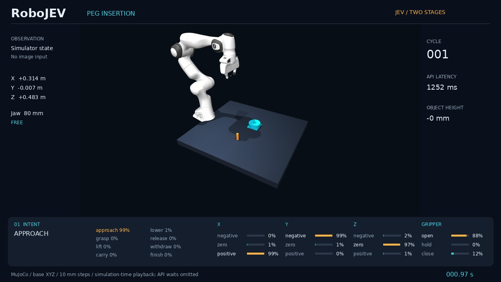
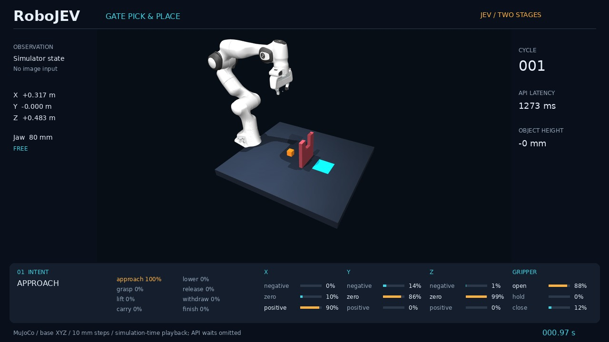
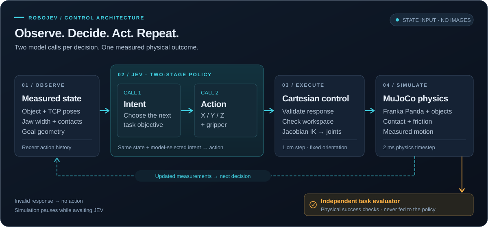

<p align="center"></p>

<p align="center"><strong>Two-stage JEV control of a Franka Panda in MuJoCo.</strong><br>Measured simulator state → task intent → Cartesian motion and gripper commands.</p>

<p align="center"><a href="https://lykycy123.github.io/RoboJEV/">Interactive showcase</a> · <a href="#todo-list">Todo list</a> · <a href="#demo-presentation">Demo presentation</a> · <a href="#quick-start">Quick start</a> · <a href="docs/evaluation.md">Evaluation</a> · <a href="README.zh-CN.md">中文</a></p>

<p align="center"><a href="LICENSE"></a>   <a href="https://github.com/lykycy123/RoboJEV/actions/workflows/ci.yml"></a></p>

RoboJEV is a small, inspectable robotics laboratory. JEV receives **structured simulator state, not images**, selects an immediate intent, then selects X/Y/Z directions and a gripper command. A Cartesian controller executes the action using real MuJoCo contacts. Each task has independent physical success checks; model answers cannot declare success.

## Todo list

**Completed**

- [x] Implement two-stage JEV control: intent selection followed by XYZ and gripper commands.
- [x] Integrate MuJoCo and Franka Panda with structured state observations and physical contact.
- [x] Demonstrate pick & place, surface pushing, and stacking on a fixed pedestal with real JEV decisions.
- [x] Complete 100 evaluation episodes across five tasks in two frozen campaigns, with an independent rule baseline and documented failures.
- [x] Publish demonstration videos, reproducible code, bilingual documentation, and an interactive showcase.

**Next steps**

- [x] Add loose-fit peg insertion and gate obstacle pick & place with independent physical failure checks.
- [ ] Extend simulation experiments to further manipulation tasks and scene configurations.
- [ ] Explore additional simulation platforms and evaluate the framework across simulators.
- [ ] Adapt the framework for real robotic arms and validate control on physical hardware.
- [ ] Integrate OpenAI API calls as an additional model backend.
- [ ] Integrate Claude Code API calls as an additional model backend.

## Demo presentation

### Part 1 — Successful demonstrations

| Pick & place | Surface push | Pedestal stack | Peg insertion | Gate pick & place |
|:---:|:---:|:---:|:---:|:---:|
| [](https://lykycy123.github.io/RoboJEV/?task=pick_place&outcome=success#experiments)<br>[MP4](site/media/pick_place.mp4) · seed 1000 | [](https://lykycy123.github.io/RoboJEV/?task=push&outcome=success#experiments)<br>[MP4](site/media/push.mp4) · seed 1000 | [](https://lykycy123.github.io/RoboJEV/?task=stack&outcome=success#experiments)<br>[MP4](site/media/stack.mp4) · seed 1000 | [](https://lykycy123.github.io/RoboJEV/?task=peg_insert&outcome=success#experiments)<br>[MP4](site/media/peg_insert-success.mp4) · seed 0 | [](https://lykycy123.github.io/RoboJEV/?task=obstacle_pick_place&outcome=success#experiments)<br>[MP4](site/media/obstacle_pick_place-success.mp4) · seed 2 |

### Part 2 — Failed demonstrations

| Pick & place | Surface push | Pedestal stack | Peg insertion | Gate pick & place |
|:---:|:---:|:---:|:---:|:---:|
| 10/10 succeeded. No natural failure video. | 10/10 succeeded. No natural failure video. | 2/10 failed; no failure recording in the original campaign.<br>[Failure evidence](docs/evaluation.md#response-validation-failure) | 10/10 succeeded. No natural failure video. | [](https://lykycy123.github.io/RoboJEV/?task=obstacle_pick_place&outcome=failure#experiments)<br>[MP4](site/media/obstacle_pick_place-failure.mp4) · seed 0 |

All five tasks appear in the same order in both parts. Videos show real JEV decisions and follow **simulation time; API waits are omitted**. The original three success videos use separate demonstration seeds; insertion and gate recordings come directly from formal evaluation. Stack uses a **fixed pedestal**. Its two validation failures were not recorded as videos in the original campaign; their evidence remains in the report.

## Results

<!-- RESULTS:START -->
| Task | JEV | Rule baseline | JEV Wilson 95% |
|---|---:|---:|---|
| Pick & place | **10/10** | 10/10 | 72.2%–100.0% |
| Surface push | **10/10** | 10/10 | 72.2%–100.0% |
| Stack on a pedestal | **8/10** | 10/10 | 49.0%–94.3% |
| Loose-fit peg insertion | **10/10** | 10/10 | 72.2%–100.0% |
| Gate pick & place | **5/10** | 8/10 | 23.7%–76.3% |

Fixed seeds 0–9 per task and policy; **100/100 episodes complete** across the original 60-trial and new 40-trial frozen campaigns. Every completed failure remains in the denominator.
<!-- RESULTS:END -->

**JEV Wilson 95%** is a confidence interval for the success rate under the evaluated conditions. With only ten trials per task, even 10/10 successes leaves substantial uncertainty; it does not guarantee future success.

The independent rule baseline uses the same physical scene and success checks. It is never a fallback for JEV. See the [protocol and failure analysis](docs/evaluation.md) and [machine-readable summary](site/data/results.json). Ten seeds per task is a small sample, not a claim of general-purpose manipulation.

New challenge recordings: [insertion success](site/media/peg_insert-success.mp4), [gate success](site/media/obstacle_pick_place-success.mp4), and [gate failure](site/media/obstacle_pick_place-failure.mp4). Insertion had no natural failure. Gate failures exposed arm-link collisions while lowering, repeated wrong-direction requests exhausting the decision budget, and one inconsistent model response. See [all seven failed trials and measured boundaries](docs/challenge-evaluation.md).

## How it works

<p align="center">
  <a href="site/media/architecture.svg"></a>
</p>

- **State:** TCP and object poses, velocity, jaw width, contact measurements, geometric relationships and recent actions. No camera input or evaluator history is supplied to JEV.
- **Intent:** a real JEV choice over task-specific intentions; task instructions and geometric helpers are engineered explicitly.
- **Motion:** `negative / zero / positive` for each axis; `open / hold / close` for the gripper. Nonzero axes form a normalized **1 cm** translation in robot-base coordinates, reduced to **4 mm** while a grasped peg is within 25 mm of the socket axis. Orientation stays downward; both policies share this step selection.
- **Execution:** Jacobian damped least-squares IK, joint position control and 2 ms physics steps. Grasping uses friction and contact, with no welded object or scripted object trajectory.
- **Validation:** malformed or inconsistent responses execute no action. Simulation pauses during API calls. Each two-stage decision makes at least two API requests.

This project demonstrates task-conditioned control from privileged state. It does not provide learned vision, robot training, arbitrary object manipulation, or real-robot deployment.

## Quick start

Linux with Python 3.11 is the tested platform. CPU physics and the rule policy need no GPU or API key. A graphics backend is required only for recording.

```bash
git clone https://github.com/lykycy123/RoboJEV.git
cd RoboJEV
conda env create -f environment.yml
conda activate jev-vla-sim
python -m pip install -e '.[test,video]'
python scripts/fetch_panda.py
robojev --task pick_place --policy rule --seed 1000
```

Alternatively install into an existing Python 3.11 environment with `pip install -e '.[test,video]'`. `fetch_panda.py` downloads only pinned robot assets, verifies checksums, and never runs implicitly at simulation startup. GPU support is not required for physics; H100 EGL rendering has been tested.

### Browser experiment console

Install the optional console once, then operate RoboJEV from a local browser without editing configuration files:

```bash
python -m pip install -e '.[ui]'
robojev-ui
# open http://127.0.0.1:8767/
```

The console configures six tasks, including the new staggered double gate, rule or JEV policies, paired batches, seeds, workers and original-state capture for later videos. **Original input remains the default.** Full geometry is an optional simulator-only ablation; it assumes measurements that are difficult to obtain in reality. The **Set up 40-trial comparison** button pairs both observation profiles on both gate tasks. See [the experiment protocol](docs/observation-experiment.md) and [completed paired results and seven original-trial recordings](docs/observation-evaluation.md). Service interruptions are reported separately; this small campaign does not establish general superiority of either input.

It keeps a local SQLite history under ignored `runs/ui/`, preserves completed trials when a batch is stopped, and never puts a TypeSafe key in commands or logs. Keys are session-only by default; selecting **Remember on this machine** stores a private file with restrictive permissions under the user config directory. On a remote Linux server, use `ssh -N -L 8767:127.0.0.1:8767 user@host` and open the same local URL. The console binds to localhost only.

The console requires Linux or WSL2 because the tested MuJoCo environment and off-screen rendering use Linux graphics backends. Physics can run without a GPU; video generation needs a working EGL or OSMesa backend and can be retried from the Run detail page when a GPU node is available.

For **real JEV**, obtain a TypeSafe API key, copy `.env.example` to `.env`, and set `TYPESAFE_API_KEY`. The file is ignored by Git. Model calls use `jev-1.13.0` at `https://api.typesafe.ai/v1/systemone` and may incur API charges.

```bash
cp .env.example .env
chmod 600 .env
# Edit .env locally; do not put the key into committed files.
robojev --task push --policy jev --seed 1000
robojev --task stack --policy jev --seed 1000 --record-video
```

Standard `HTTPS_PROXY` is supported where necessary. No cluster, account or private proxy settings are required by the public code. The original `jev-sim` command remains an alias for `robojev`; the Python package is `jev_vla_sim`.

## Evaluate and reproduce

The new `peg_insert` and `obstacle_pick_place` tasks add loose-fit insertion and transport through a narrow gate over a low crossbar. The insertion uses a 20 mm peg, 30 mm socket and at least 30 mm depth. Gate traversal requires a 40 mm cube to clear a 120 mm crossbar between posts with a 70 mm opening. See [physical boundaries](docs/tasks.md) and the [challenge report](docs/challenge-evaluation.md).

```bash
robojev --task peg_insert --policy rule --seed 1000
robojev --task obstacle_pick_place --policy jev --seed 1000
python scripts/evaluate_suite.py --tasks peg_insert obstacle_pick_place --workers 4 --capture-video-state
# Render original success/failure trial states with one EGL process, without calling JEV again.
python scripts/render_captured_episode.py runs/robojev-evaluation/RUN_ID
python scripts/export_challenge_results.py runs/robojev-evaluation/RUN_ID
```

Challenge videos come from the fixed-seed evaluation itself. The earliest success and earliest natural failure are selected per task; no failure is manufactured when all ten JEV trials succeed. Captured physical states, original model probabilities and failure evidence are preserved. Videos omit API waits and append a labeled two-second outcome still. Original three-task videos retain their separate demonstration seeds and source fingerprints.

```bash
# Original CPU-only paired evaluation: 3 tasks × 10 seeds × 2 policies = 60 episodes.
python scripts/evaluate_suite.py --tasks pick_place push stack --workers 4

# Resume incomplete work with identical source/configuration; completed failures stay failures.
python scripts/evaluate_suite.py --resume runs/robojev-evaluation/RUN_ID

# One task, explicit evaluation seeds; no video unless requested.
robojev --task stack --evaluate --seeds 0 1 2

# Sequential recording in one rendering process at a time.
python scripts/demo_suite.py --seed 1000

pytest -q
ruff check src tests scripts
```

Complete run logs, API responses and videos are written under ignored `runs/`. Summary files contain timings, failure reasons and usage. Record videos separately from parallel evaluation: concurrent EGL rendering proved unreliable in the tested cluster setup.

| Area | Location |
|---|---|
| Task definitions and success checks | `src/jev_vla_sim/tasks.py` |
| JEV requests, validation and baselines | `src/jev_vla_sim/policy.py`, `push_policy.py` |
| Physics, observations and Cartesian control | `src/jev_vla_sim/mujoco_backend.py`, `state.py` |
| Evaluation and recording tools | `scripts/` |
| Static showcase, selected media and public metrics | `site/` |

[Task specifications](docs/tasks.md) · [Cluster usage](docs/cluster.md) · [Publication policy](docs/publication.md)

## Acknowledgments and license

RoboJEV code is released under [Apache-2.0](LICENSE). Robot assets come from [MuJoCo Menagerie](https://github.com/google-deepmind/mujoco_menagerie), pinned to commit `822c2d8f877dd166c5b7d3c9f7e3c3b6589473b7`, and retain their Apache-2.0 license. Simulation uses [MuJoCo](https://mujoco.org/); model inference uses [TypeSafe JEV](https://typesafe.ai/). See [THIRD_PARTY.md](THIRD_PARTY.md).

This is an independent integration and experiment suite, not an official product of the upstream providers. Task decomposition, structured state and Cartesian control are established techniques; no novelty claim is made for the two-stage pattern.
